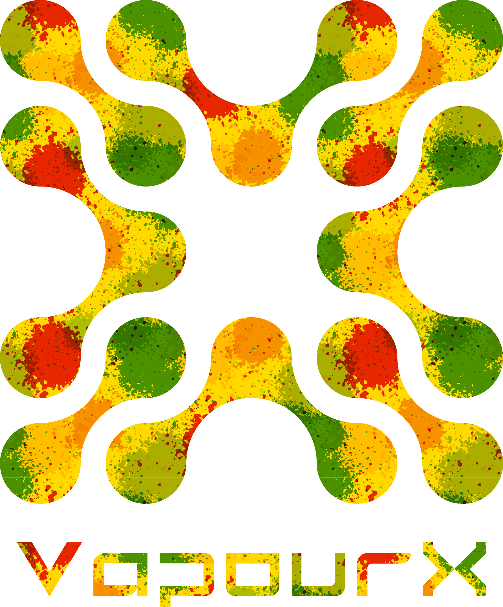

# VapourX Open Forum

  

  
<strong>人机合一，化具象为抽象</strong>

  

    
  

## 🚀我们正在做的

VapourX 正在汇聚一群对具身智能充满热情的爱好者、专业人士和研究人员，致力于推动人类、数字人和机器人之间的自然交互，促使具身智能从研究走向现实，在产业与创新中实现无缝演进与深远影响。

## 🪐你可以得到的

- 高光论文分类整理
- 来自我们每一位社区共建者的Blog
- 未来可能的活动（Online Coffee Chat、Paper-reading Open Meeting等）

## 🌐 Website

Visit our website: [VapourX Open Forum](https://vapourx-scalelab.github.io)

## 🏋️欢迎加入建设

联系我们来加入共建团队，我们追求所有热爱具身智能的伙伴！

## 👥 Community Contributors

  <h3>小伙伴们</h3>

  <table>
    <tr>
      <td align="center">
        <a href="https://github.com/ACondaway">
          
           
          <b>ACondaway（徐聪晟）</b>
        </a>
         
        VapourX主理人/SJTU
      </td>
      <td align="center">
        <a href="https://github.com/10-OASIS-01">
          
           
          <b>OASIS（刘艺彬）</b>
        </a>
         
        VapourX元老/NEU
      </td>
      <td align="center">
        <a href="https://github.com/VioletEvar">
          
           
          <b>Violet（刘伊天）</b>
        </a>
         
        VapourX元老/SJTU
      </td>
      <td align="center">
        <a href="https://github.com/hzyangjc">
          
           
          <b>Andreo Y.（杨锦畅）</b>
        </a>
         
        VapourX元老/SJTU
      </td>
    </tr>
  </table>

  <h3>贡献者统计</h3>
  

  
<em>想要成为贡献者？请联系我们！</em>

  

    
<strong>联系方式：</strong>

    

      📧 <strong>邮箱：</strong> <a href="mailto:acondaway@sjtu.edu.cn">vpx-mail</a>
    

    

      📱 <strong>小红书：</strong> <a href="https://www.xiaohongshu.com/user/profile/645fc2f60000000029014a80?xsec_token=YBr2weXWhfZAtQcADkrSlIJu0brI4Swl_YI5E_P87nf2A=&xsec_source=app_share&xhsshare=CopyLink&appuid=645fc2f60000000029014a80&apptime=1754037228&share_id=92ba06a8d77342a1a79de3e7837c18d0" target="_blank">@ACondawayUNo</a>
    

  

## 📊 GitHub Star History

  

