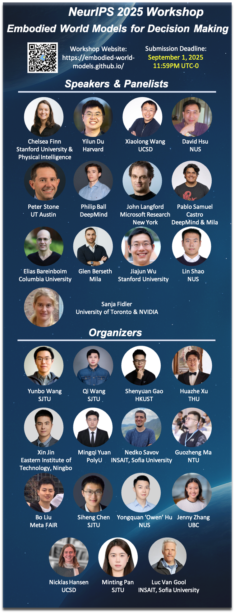

我们组织了 NeurIPS 2025 世界模型 Workshop “**Embodied World Models for Decision Making**”，关注世界模型相关的理论基础、算法创新或实际应用，**Genie 3 的核心贡献者** Philip Ball 也会给 Talk，欢迎大家参加、投稿~

📍地点：San Diego, CA, USA
🗓️ 截稿时间：9月1日 11:59PM UTC-0
🌐 网站：https://embodied-world-models.github.io/

🔍**主题涉及但不限于**： 

🚀 基于模型的强化学习与长程规划
探讨世界模型如何助力基于模型的强化学习，重点关注样本效率、性能表现以及可扩展性。特别强调长程规划（long-horizon planning）问题，即要求智能体在时间跨度较大的任务中，推理并执行一系列连续动作、预测延迟反馈结果，并在面对不确定性和有限反馈的情况下，仍能在时间上保持策略一致性。

🤖 机器人学习中的仿真与现实物理对齐
研究如何弥合仿真环境与现实世界物理之间的差距，以提升机器人学习效果。这包括使用生成模型更准确地捕捉物理动态，从而改进感知、规划与控制；建模不确定性和反馈效应；并学习可从仿真环境稳健迁移到现实世界的扩散策略。

🎮 交互式场景生成与下游任务
构建能生成物理合理、语义一致的交互式视频模拟模型。研究重点包括：基于动作条件的场景合成、智能体与环境之间的可控动态模拟，以及面向下游任务（如规划与策略学习）的评估方法和基准的开发，特别关注视频保真度、时间一致性与可控性等指标。

🧠 视频-语言-动作（VLA）模型与大语言模型中的世界知识利用
研究大规模预训练模型如何统一视频、语言与动作的表示，以支持鲁棒且具泛化能力的策略学习。关键研究方向包括：构建多样的多模态数据集、提升跨模态对齐能力、开发高效的参数微调方法，以及使智能体在仿真或真实环境中执行复杂的语言引导任务。同时也关注如何利用大语言模型中蕴含的结构化与非结构化世界知识来引导智能体决策。

🚗更广泛场景中的应用：开放世界游戏与自动驾驶
将世界模型推广至真实环境与高保真模拟器中的具身智能体应用场景。重点研究方向包括：感知与控制的集成、从仿真到现实的迁移（sim2real）、持续学习与适应能力，以及在 Minecraft、自动驾驶和真实互动环境等开放式任务中的部署与执行。

