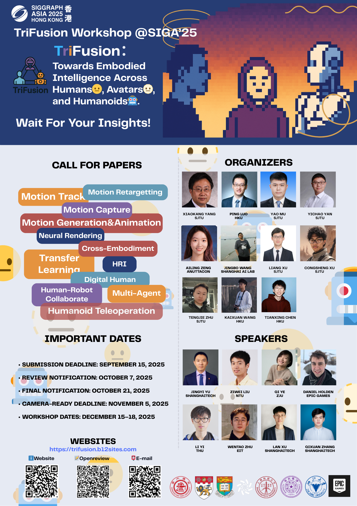

## 活动概述
本次活动将会在SIGGRAPH ASIA 2025展开，主办方是上海交通大学和香港大学，并且得到了很多的机构的支持。

其中该Workshop由多名VapourX的成员参与组织与管理，覆盖面包括Student Leader和Committee。

本次活动将会邀请到数字人和机器人领域的专家进行专题分享和圆桌会议，并且设立了若干个workshop paper track，非常期待各位的参与！

## 活动海报

## To Know More

更多信息将会在官网持续更新：[TriFusion 2025 @ SIGGRAPH ASIA](https://trifusion.b12sites.com)

欢迎各位通过Google Form注册并选择意向参加workshop or challenge track：[Google Form](https://forms.gle/UVSDcdhon6dtZrQ9A)

欢迎各位的关注与参与！