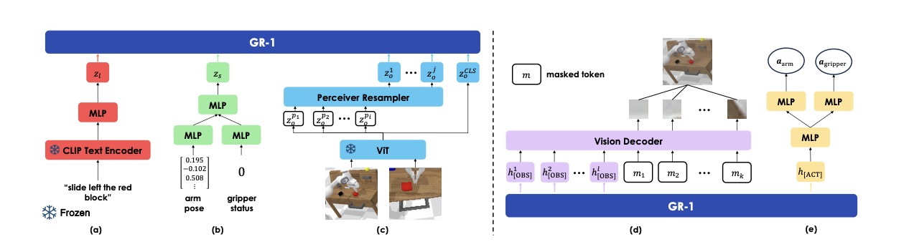
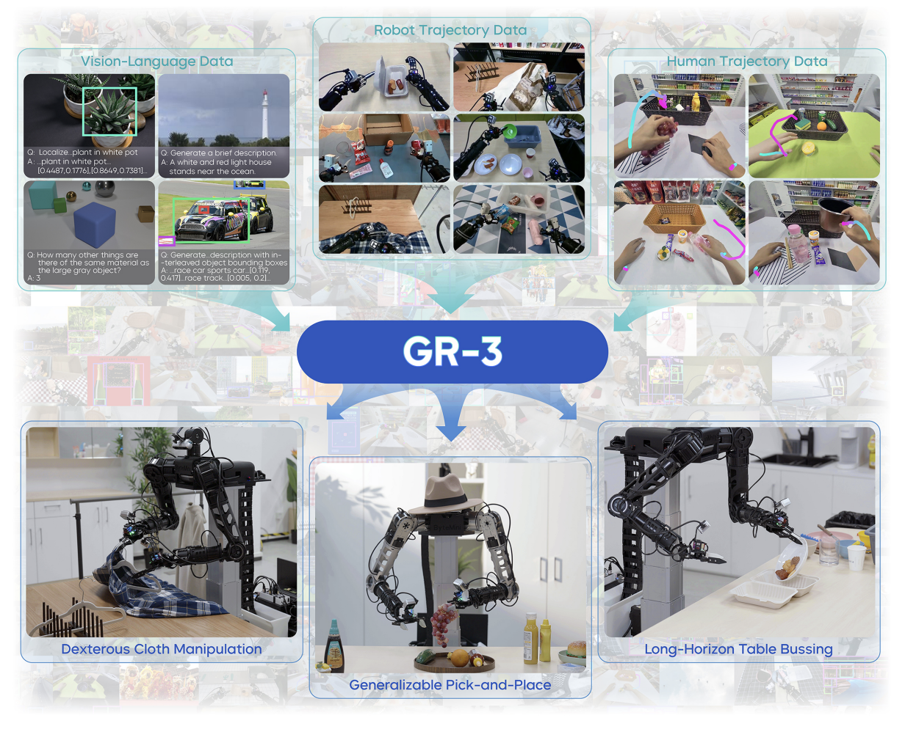

import ImageTextLayout from '@/components/custom/ImageTextLayout.astro'

# GR-1

## Overview

这篇文章将NLP和CV中常用的生成式预训练模型的思路迁移到了具身的操作当中，意在解决多任务视觉-语言条件下的机器人操作，其中GR-1首次在视频预测任务上进行预训练，通过模型Video Generative的能力的预训练，让模型能够预测未来帧和未来事件。

在当时，GR-1的横空出世可以说刷爆了CALVIN benchmark的榜单，从这个角度上来说，通过统一的GPT风格的transformer和基于大规模视频预训练的模型，大大提升了具身操作的性能。

## Method

### 视频生成预训练

在这个过程中，需要让模型能够在给定语言描述和历史观测帧来预测后向的视频帧。

$$
\pi(l, \boldsymbol{o}_{t-h:t}) \rightarrow \boldsymbol{o}_{t + \Delta t}
$$

对于训练的数据结构，是一段文本，对应一整个视频序列

$$
v = \{l, \boldsymbol{o}_1, \boldsymbol{o}_2, \boldsymbol{o}_3, ..., \boldsymbol{o}_T\}
$$

### 多任务视觉操作模型

将语言描述、历史观测和历史状态作为模型的输入，得到后向的视频的预测和action的输出，这个时候作者将整个数据集定义成专家轨迹的形式以o-s-a的形式进行组织。

$$
\pi(l, \boldsymbol{o}_{t-h:t}, \boldsymbol{s}_{t-h:t}) \rightarrow \boldsymbol{o}_{t + \Delta t} + \boldsymbol{a}_t
$$

$$
\{\tau\}_{j = 1}^{M} = \{l, \boldsymbol{o}_i, \boldsymbol{s}_i, \boldsymbol{a}_i\}_{i = 1}^T
$$

对于不同的任务都收集了对应数量的专家轨迹。

## 模型框架

模型整体选用了GPT风格的Transformer，这种架构已然证明了他们的上下文推理能力和多模态能力。

模型选择任务描述和视觉输入以及本体状态作为输入，最终输出动作。

对于语言输入，模型采用预训练的CLIP风格的文本编码器；对于视觉输入使用MAE预训练的ViT进行编码最后输出[CLS] token作为整体表征，对应输出的patch token，会通过Resampler来产生最终的输入GR-1的Token；对于本体状态的输入，使用线性层进行编码得到对应的表征，具体来说，输入了末端执行器的6Dpose和夹爪的二元信息。

在输入到GR-1之前，所有模态的信息通过一个线性层进行维度上的对齐，确保整体的稳定性。为了动作的预测，文中额外增加了[ACT] token，对于视觉信息的预测，文中额外增加了[OBS] token。

在预训练阶段，得到的token被表示为

$$
(l, \boldsymbol{o}_{t-h}, [OBS], ..., l, \boldsymbol{o}_t, [OBS])
$$

使用机器人数据进行finetune时，得到的token被表示为

$$
(l, \boldsymbol{s}_{t-h}, \boldsymbol{o}_{t-h}, [OBS], [ACT], ..., l, \boldsymbol{s}_t, \boldsymbol{o}_t, [OBS], [ACT])
$$

为了权衡模态之间的信息权重，语言模态在时间戳上重复使用，为了增强时序性，在每一个时间戳都提供了相应的时间戳embedding。

网络遵循causal attention机制，在预训练的过程中除了[OBS]token，其他token能够获取到其之前所有的token的信息，在微调阶段，除了[ACT]和[OBS] token，其他token只能获取在其之前所有的token的信息。

最后输出阶段，使用由自注意力机制和MLP组成的transformer decoder，decoder主要处理[OBS]对应的输出以及mask tokens，mask token对应的输出会用来重建预测的未来图像的patch。对于[ACT] token对应的输出，则会通过线性层映射得到预测的动作。对于图像使用MSE loss监督；对于末端6D pose使用Smooth-L1 Loss，对于夹爪的状态则使用BCE Loss

在训练的过程中，预训练使用了大规模视频数据Ego4D，预训练阶段只需要使用视频预测MSE损失进行监督；微调阶段则使用机器人数据进行端到端的优化，在这个过程中会用到上述的所有Loss同时进行行为克隆训练和视频预测训练。

# GR-2

## Overview

接续GR-1中的思路，GR-2更进一步地扩增了预训练的数据集的来源，用超过500亿的token进行训练，使得GR-2能够很大程度拥有Generalist的能力，甚至展现了对未见场景（心背景、环境、物品、任务）的泛化能力。

对于其他领域的Foundation Model，其实有一个很重要的衡量指标就是泛化性和高效微调能力。对于一个Generalist来说，掌握大量的manipulation技能是最基本的，另外它需要有很强的学习新知识和处理干扰的能力，在整个过程当中，GR-2依然采用视频预测预训练+本体微调的思路。

## Method

模型的核心价值就是要训练一个universal policy，依然给定语言指令、观测和状态，输出后几步的动作，对于输入，依然使用一个冻住的text encoder来编码语言，并且使用VQGAN来训练视觉输入，以得到离散token，robot state则使用线性层进行处理，在微调阶段，这个部分依然是可以训练的。在这次的预训练过程当中使用了更大规模的数据集进行训练，除此之外作者还搭建了一套数据的筛选和重新标注的管线。

作者使用了数据增强的方式来，对模型的场景可泛化性做出了提升，主要的方法包括对于背景的更改和场景中其他物体的增加，文中通过将自采集的物体数据集和Open Image dataset上的数据进行训练，得到的扩散模型生成器就可以实现对场景中的物体的编辑，对于背景的更换，则使用SAM进行，前景分割和后景贴图，最后使用视频生成模型进行增强数据的产出。可以看出，对于GR-2，核心提升的就是泛化能力和多任务处理能力，包括后续的一些实验，也集中在unseen场景的处理当中。

# GR-3

GR-3延续之前的理念，追求更加泛化，这次还包括了对模糊语言指令的处理，另外模型也支持对少量人类轨迹数据的微调。这次的更新更像是系统性的更新，包括了采集infra的搭建和数据处理管线以及模型训练范式的革新。在Demo视频中有一个非常亮眼的表现就是对易形变物体的灵巧操作的能力的展现。

整个VLA模型的VLM部分使用的是开源的Qwen2.5VL模型，对于输出，相比于前两代，这一代使用了现在流行的action-chunk，并且使用了flow matching方法作为action expert。为了加强泛化能力，作者使用大规模的VL数据和具身数据进行co-train，这里co-train就意味着这两类数据的来源和分布差异是比较大的。通过这种方式模型不仅能够掌握新物体的理解，同时也能对一些抽象的表述（大小、空间关系、常识等等）进行理解。并且实现了用极少量的human trajectory数据对于模型的快速适应微调，同步地，他们还搭建了一套双手的VR遥操作数据采集infra。总的来说，这篇工作更加注重具身系统这一观念。

这篇工作中设定了很多具有挑战性的任务，包括具有泛化性的pick-and-place、长程的桌面整理（类似于π0）、对于高变形度的衣物的操作，可以说锚定的都是日常生活的操作。

## GR-3模型设计

GR-3模型采用的是端到端的VLA模型架构，通过历史信息的输入输出对应的action chunk，并且采用了MoT架构来处理多个相机视角下的图片流，对于多视角图像和语言指令，文中使用预训练的Qwen2.5-VL-3B-Instruct作为backbone，并且使用DiT来作为action的输出，对于action的预测，使用了flow matching作为目标，FM模型由robot state和KV cache共同控制生成。通过多层的action DiT对action chunk的优化，并且中间对flow matching timestep使用AdaLN进行注入。另外使用causal mask来确保输出的action chunk内部的时序性。

在推理的过程中，进行了相应的优化设计来确保推理速度，首先对于action DiT，他的Transformer层数是前端的VLM的一半，而在VLM的Transformer的计算中，只会缓存后半层的Key/Value信息来得到相对来说语义更强的特征，通过这种方式，也加速了推理的进程同时确保结果的质量。

为了确保训练的稳定性，在attention和FFN的线性层后都使用了RMSNorm。

## Training Recipe

**训练目标：**对于大规模、多源头数据的训练，本身具有很重要的研究价值。首先对于robot trajectory来说，会使用模仿学习的方法来最大化策略的似然，另外对于action prediction会使用Flow matching Loss进行监督，不同于π0使用ß分布的时序采样，这里使用了均匀分布的时序采样。为了加速训练，FM loss会在一次VLM的钱想过程中通过多次采样FM的时间步进行训练，在本文中仅使用五步Flow Matching，这相比于π0的十步能够减少一半的开销。

**数采管线：**在数据采集的流程中，团队也十分关注数据的域随机化程度以及质量筛选。

**增强语言信息：**作者使用了task status作为动作空间的额外维度来提供辅助监督，实现任务状态的理解和条件注入，其中用的是双极性编码的思路，分别表示为Ongoing、Terminated和Invalid状态。Ongoing表示了机器人正在task的运行途中，而Terminated表示任务已经完成，最后的状态则代表了文字和观察内容的不相符，这也一定程度上解决了RDT所面临的一些问题。在训练的时候会随机将文不对题的instruction作为训练数据来强制让模型具备图文匹配的理解，提升了VLA中L的作用。

**Co-Train：**为了实现对于OOD指令的泛化性，文中对GR-3进行了Vision-Language data的训练，这个过程当中对于VLM和DiT都进行了相应的训练，VLM用NTP（Next-Token-Prediction）作为训练目标，而Action Expert则使用FM loss进行监督训练，可以看算法图的右半部分，在这个过程当中，文中是动态混合部分VL数据在一些robot trajectory中来促进模型的泛化性学习的，其实这里让博主有些疑惑，这样的训练方式是否能够work，它到底从中能学到什么。

**Few-shot：**最后文中通过少量的真机轨迹的采集和微调，实现了GR-3的few-shot能力。

## System

团队还特别推出了移动机器人平台ByteMini robot，实现了22自由度的双臂移动机器人本体的设计，并且还对手腕做了球轴设计实现了更加灵动的操作，并且能够实现更大的工作空间。

# 总结

总的来说，GR系列的每一个工作都是这个阶段具身的集大成者，并且能够充分把算法和大规模数据训练结合，我们会发现GR-3相比前两个模型产生了非常巨大的变化，逐代演进也映射了具身的发展，从一开始纯粹的数据驱动的模型训练，到数据筛选机制介入与更大规模的训练，再到如今从数据采集到大规模数据训练、VLM+action expert的新架构，其中暗含了每一个具身时期，这个社区在关注的事情。或许未来具身社区的工作会更加注重系统观念，但或许只有这样，这个社区才可以慢下来、精心做好一整个具身智能所关乎的流程。或许在这样的发展之下，终有一天，具身会走入每家每户，成为人类社会不可或缺的一部分。

  

  

  

Know about **VapourX**

**"人机合一，协同进化，化具象为抽象，寓抽象于具象。"**

  

# 参考文献

[1] [UNLEASHING LARGE-SCALE VIDEO GENERATIVE PRE-TRAINING FOR VISUAL ROBOT MANIPULATION](https://arxiv.org/pdf/2312.13139)

[2] [GR-2: A Generative Video-Language-Action Model with Web-Scale Knowledge for Robot Manipulation](https://arxiv.org/pdf/2410.06158)

[3] [GR-3 Technical Report](https://arxiv.org/pdf/2507.15493)