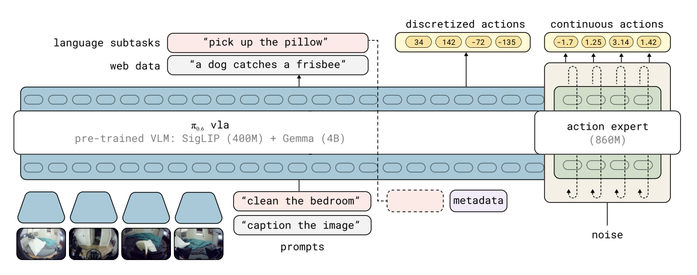
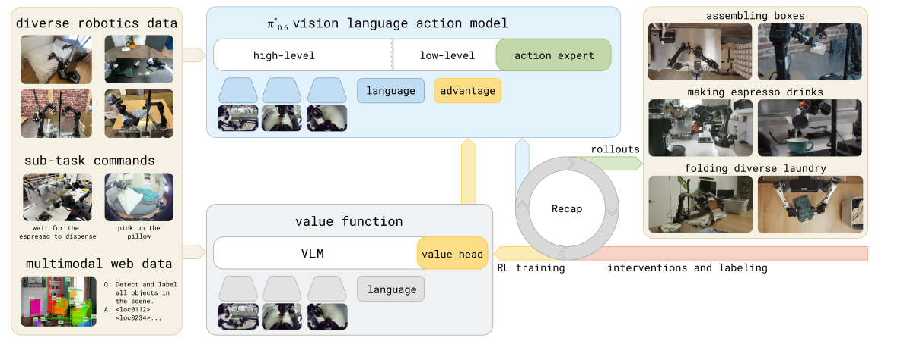
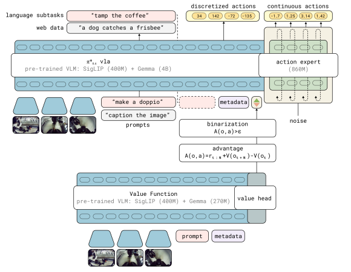
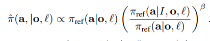
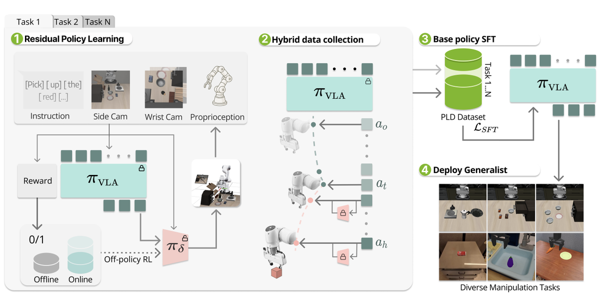
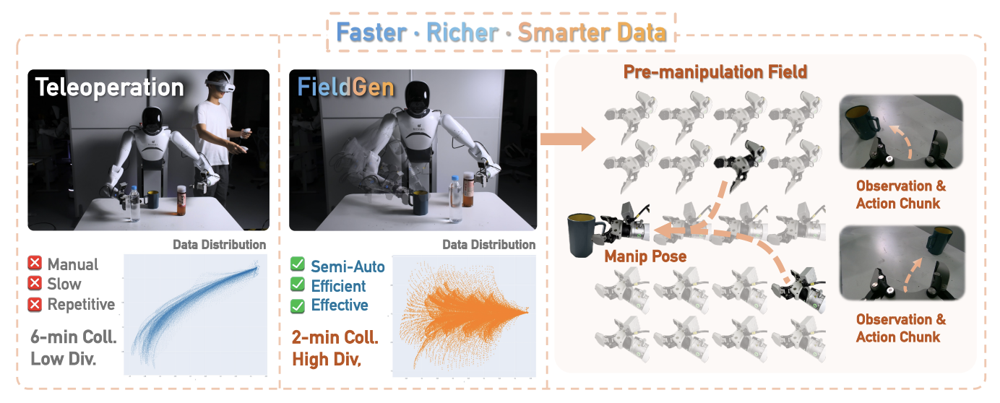

## 引言

今天π\*0.6的technical report发布了，从π0开始，Physical Intelligence的每次发布都带给了这个社区新的惊喜和惊吓，而每一次的发布也将会引领这一阶段具身的主流发展路线，本次将会解读π\*0.6模型中的技术细节以及与之相关的几篇近期工作。

## What about π0.6?

π0.6模型是基于π0.5模型的更新，它能够更加流畅地表征action chunk分布，并且能够产生中间步骤的文本和高层推理，这得益于训练过程中使用到了Knowledge Insulation的方式，达成了离散和连续的动作token都可以被端到端表达，同时使用梯度截断来实现对flow matching模型对模型剩余部分的影响。

在训练数据上，π0.6使用了多机器人的数据，基础的VLM模型换为了Gemma3-4B，并且扩增了action expert的体量。

所以对于π0.6而言，模型的形式化表达就变成了：

$$
\pi_\theta(a_{t:t+H}^c, a_{t:t+H}^d, \hat{l} \vert o_t, l)
$$

同时我们注意到，在构建的过程中，实际上左边的action token是分为离散和连续两类的，输出的三项理论上来说互相独立，所以在建模最大似然估计的时候也可以进行分离。

$$
\log \pi_\theta(a_{t:t+H}^c, a_{t:t+H}^d, \hat{l} \vert o_t, l) = \log \pi_\theta(\hat{l} \vert o_t, l) + \log \pi_\theta(a_{t:t+H}^c \vert o_t, l) + \log \pi_\theta(a_{t:t+H}^d \vert o_t, l)
$$

## What about π\*0.6?

### Overview

整体来说，π06定义了RECAP的模型训练范式，实现了模型的自我提升（self-improvement process），它将Demonstratino数据、on-policy数据以及遥操作intervention数据都加入到训练当中，实现了很多真实场景的高成功率和困难任务的低失败率。文中提到，这种学习的范式遵从着一种“需要精进一种技术就需要反复练习和反思”的哲学，而这也是近期很多工作提到的。而其中非常重要的路径就是强化学习，但对于真实世界来说，强化学习的问题就在于如何得到合理的reward feedback以及如何从异构的数据和不同的策略中学习。本文中提到的RECAP（RL with Experience and Corrections via Advantage-conditioned Policies）就意在提供一种解决方案。

### RECAP概览

RECAP首先使用离线强化学习预训练VLA实现初步的能力，另外也会对策略部署过程当中收集的数据进行训练，因为策略在部署过程当中会得到真实世界的一种简单的稀疏反馈，也就是成功与否，所以此时就得到了有sparse reward的训练数据。在离线强化学习的过程中，同时训练了一个Value function进行策略部署过程当中的价值评估，主要评估任务的完成度，同时也可以使用这个Value function做数据集中每一个action的advantage估计，因此可以得到受到改善的策略。

在离线强化学习预训练过程当中，数据集的来源是多样的，文中提到其实还有一个π0.6模型，但是显然这个并没有成为一个单独的文章出现，只是提到这个模型有更大的backbone和更加多样的conditionning方法，而本文就是基于这个模型加上了离散的advantage value的结果。文中提到用这种自动化收集经验的方法能够加倍throughput同时降低失败率，作者使用这个模型实现了对做浓缩咖啡、折箱子以及全新场景的叠衣服任务的微调。

总的来说，RECAP在数据采集上实现了多种不同来源数据的获取以及稀疏的结果导向的标注，对于一些数据，会进行人为干预实现纠正，在价值函数训练上使用了所有采集到的数据来获取一个能够检测失败和完成度的reference Value function。在训练的prefix条件注入中加入了advantage value来提供一种简单但高效的价值引导训练，实现对于次优和更优策略的提取。

这是第一个实现了通用意义上的强化学习方法，过程中注入了人类的价值反馈和干预。接下来会具体解释价值函数的训练以及优势条件注入下的训练。

### 价值函数训练

从结构上，价值函数使用了和VLA架构相同的，但是体量更加小的VLM，并且将价值评估建模成了，从文本和观测映射到价值的分布，其中这个分布是一个离散价值分布。

在训练过程当中，会对每一个轨迹的回报首先进行量化（也就是将连续数值离散化，学过通信原理和DSP的同学们应该都比较清楚这个概念），随后使用最小化交叉熵的方法来进行训练，得到一个有整个数据集先验的critic model，**离散化这一步对于训练时非常有效的**，因为这样避免了学习连续的价值分布增加收敛的困难性，随后可以再通过反向求解的方式得到连续的价值评估。

$$
\min_\Phi \mathbb{E}_{\tau \in \mathbf{D}}[\sum_{o_t \in \tau} H(R_t^B(\tau)), p_\Phi(V \vert o_t, l)]
$$

使用这个critic model我们就可以去对人类演示数据下训练的策略进行蒙特卡洛评估，但是这种策略在线的评估器并不如无策略的Q function estimator，但是这种方式会更加简单和可靠，文中也提到一个off-policy的estimator会对策略评估有更大的帮助。

### Advantage Conditioning Policy Extraction

在已经拥有了价值函数之后，我们就可以进入到优化策略的进程中，这个过程被称为策略提取（policy extraction），本文中使用的方法就是advantage conditioning。反观其他方法，策略梯度由于无法提供完整的似然估计而并不能适用于Flow Matching Model的策略提取，AWR使用简单的监督学习目标导致了数据集中的关键信息的丢失。Advantage Conditioning将所有的数据集中的数据放在一起进行监督学习，同时也输入了一个表示动作的好坏数值，这个数值来源于advantage。

使用贝叶斯定理可以重写策略提升的分布，

因此可以得到一个优化过程的正则闭式，另外通过这种方式就不必再显式地表示策略提升概率，只需要分别表示基础策略和indicator conditioned策略就可以，文中提到这种方式就和calssifier-free guidance类似，分别使用有无condition的模型来建模数据分布。对于indicator来说，服从delta分布，会基于task-relevent信息进行门限控制建模分布。

$$
p(I \vert A^{\pi_{ref}}(o, a, l) = \delta(A^{\pi_{ref}}(o, a, l) > \epsilon_l))
$$

最后可以通过一个优化对数似然估计的问题来优化策略，在这个训练过程当中，使用到的数据就是收集到的所有数据。为了让human correction更有作用，作者强制将这些行为建模为indicator=True的形式。

## 如何构建self-improvement具身学习系统？

其实对于LLM来说Self-evolution并不是一个稀奇的事情，在LLM和Agent领域已经积累了很多从经验中学习的方法，而对于具身来说，最困难的事情就在于如何去建模真实世界的价值评估体系以及如何构建高效的自进化系统。以下几篇文章是最近博主读到过的相关的工作。

### PLD：使用Base Policy进行探索，使用Residual Policy自进化

本文通过RL generator实现了自动化的数据采集和自进化搭建。流程上说，通过首先训练一个任务的base policy并且将这个policy进行冻结后，使用off-policy RL进行残差行为的训练，随后基于这个base policy在rollout的过程中采用动态残差模块接管机制实现自动化的采集，最后所有的数据被整理在一起作为SFT蒸馏数据的基础。

所以使用残差接管的采集得到的数据构成为：

$$
\{(s_1, a_{b, 1}), ...,(s_{t-1}, a_{b, t-1})\} \cup \{(s_t, a_{b, t} + \bar{a}_t), ...\}
$$

对于这种方法，残差模块主要是为了补全次优区域的不足，方法上达到了不错的效果，只可惜局限于单任务的RL，并没有做到General Purpose。在探索的过程当中，使用Q function做Off-policy的探索。

### FieldGen：半自动采集数据方案

通过分别对现有的数据分布中的joint和gripper构建锥形场和球形场来规模化新的数据轨迹，实现对真机数据的扩增，同时也是用了advantage-conditoining的方法来构建reward、value来对生成的数据进行筛选和进一步的训练，但是仅仅对pick任务进行了设计，这种半自动化的采集方案还有望对更多的任务进行扩展。

### Minor Takeaways

- 如何从Off-policy出发去构建更好的价值评估体系？

这个其实已经在这篇文章中提到了，或许使用Q Function能够进一步地提升价值评估的能力。

- 如何达到高效的online real world RL训练范式？

这更多是一个数据采集与处理的设计问题，数据采集层面上，我们或许需要接入一些柔顺接管的方案去提升online correction的数据质量，另外一方面我们也需要使用更加合理的通用Critic Model去做监督，实现自动化的监管与接替（模型或者人类），比如VLAC就是个很有用的工具。

- 除却真机，如何在仿真上构建？

从数据层面上，我们可以更大规模的使用仿真数据来构建Critic Model，另外工作如CTRL-World、WMPO以及WorldEval都在构建仿真环境的世界模型评估框架，这都是有望进一步提升策略的通用性和泛化性的途径。

---

# 参考文献

[1] [a VLA That Learns From Experience](https://www.physicalintelligence.company/download/pistar06.pdf)

[2] [π0.6 Model Card](https://website.pi-asset.com/pi06star/PI06_model_card.pdf)

[3] [SELF-IMPROVING VISION-LANGUAGE-ACTION
MODELS WITH DATA GENERATION VIA RESIDUAL RL](https://www.wenlixiao.com/self-improve-VLA-PLD/assets/doc/pld-fullpaper.pdf)

[4] [FieldGen: From Teleoperated Pre-Manipulation Trajectories to
Field-Guided Data Generation](https://arxiv.org/pdf/2510.20774)

[5] [VLAC: A Vision-Language-Action-Critic Model for Robotic Real-World Reinforcement Learning](https://github.com/InternRobotics/VLAC/blob/main/data/VLAC_EAI.pdf)

[6] [Ctrl-World: A Controllable Generative World Model for Robot Manipulation](https://arxiv.org/abs/2510.10125)

[7] [WMPO: World Model-based Policy Optimization for
Vision-Language-Action Models](https://arxiv.org/pdf/2511.09515)

[8] [WorldEval: World Model as Real-World Robot Policies Evaluator](https://arxiv.org/pdf/2505.19017)
