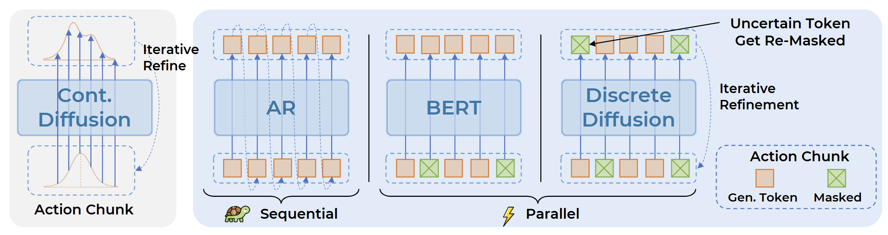
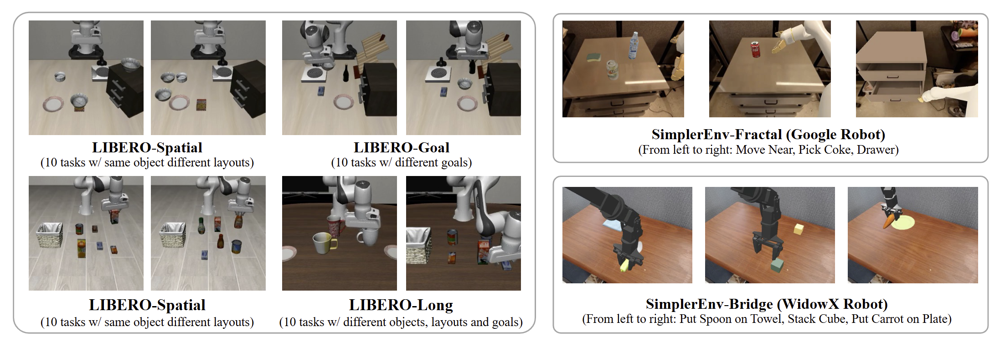

## TL;DR

我们将离散扩散（discrete diffusion，也即LLADA使用的diffusion方法）做成VLA内部的动作解码头使得VLA保持单一Transformer结构。配合两项机制，自适应解码顺序与二次重掩码，实现更稳定的一致性细化，在多种设置下均优于自回归与连续扩散解码。我们的训练目标与 VLM 保持一致，最大限度保留VLM的预训练先验，并在成功率上取得更好结果。

## What's new

- 首次将离散扩散引入 VLA 的动作解码头。

- 单一 Transformer、VLM 式训练：保持离散 token 接口，并使用与主干一致的 CE 损失 → 最大化保留 VLM 的预训练先验。

- 自适应解码顺序：每一轮基于置信度/置信度差优先保留"容易"的 token，并用余弦策略下调保留比例；其余位置继续保持为 [MASK] 进入下一轮细化。

- 二次重掩码：对已保留的位置做阈值 + 残差下降检查；若存在不确定/不一致则回掩码，实现稳健的跨轮次纠错。

## Why it matters

- 与连续扩散解码不同，我们把动作生成完全保留在统一的 Transformer 内部，并沿用 VLM 的交叉熵训练目标。这既能最大程度承接 VLM 的视觉—语言先验（可类比为给模型"扩展词汇表"），也为继承统一 Transformer 的规模化规律提供路径，推动大规模 VLA 研究。

- 同时，Discrete Diffusion VLA 打破了自回归左到右的瓶颈：在少量、固定步数内并行自适应地产生动作片段；对置信度不足的 token 可通过迭代重掩码反复校正，保持了diffusion的逐次修正特性，充分利用跨模态上下文（包括动作token间依赖）进行持续细化。

## Links

Paper：https://arxiv.org/abs/2508.20072

Hugging Face（& Demos）：https://huggingface.co/papers/2508.20072