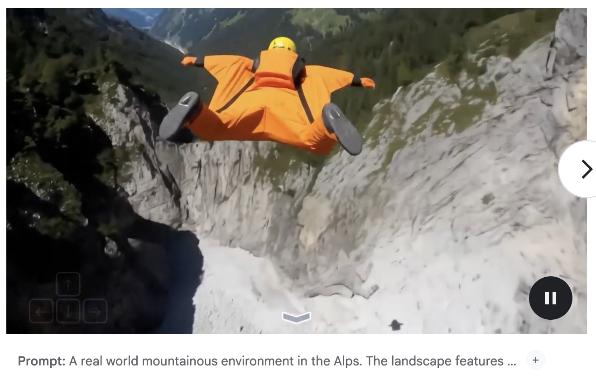

## 什么是世界模型？

从博主的视角，所谓世界模型，就是一种对于现有的感知的信息提炼和处理，经过强有力的对于物理世界和客观规律的先验的映射而得到非常准确的对于感知的反馈。从认知科学的角度，"具身认知"这种观念是十分重要的，1991年，Brooks提出了"无表征智能"，倡导使用行为来驱动机器人的架构。

这个过程更像是人类的大脑在做的事情，通过去处理各个器官的感知信息来做出合适的反馈。那么在这里就会有很多下分的方向，这些都代表了不同意义的世界模型的构建。

世界模型最早由Ha和Schmidhuber提出，证明了可以通过学习生成式环境模型来让agent在其内部的Dream中训练和迁移。

以Genie为代表的谷歌发起的世界模型主要是通过有条件视频生成的技术路线实现了对于物理世界未来预测的反馈，这种范式也得到了很多研究者的认可，通过生成一些全新的场景，并且在这些场景中进行交互得到这个场景的动态反馈，那么就相当于在pixel-based的环境中当中创建了一个现实世界的映射。当然包括对于物体的性质的预测也好或者对于一些环境中的物体的反馈或者整个环境的变化的预测也好，归根结底，都在做预测，这一类统称为基于预测的世界模型。另外有基于风格迁移的世界模型，通过特定输入引导输出结果，风格化、结构化地调节模型的生成，这对于环境重建和数字孪生有很大的作用。最后还有推理模型，这个过程当中，通过比如思维链等方式就可以推理出一些有用的信息和有用的行为。这对于具身操作和自动驾驶等研究方向都有重要的指导意义。

## 从Genie说起

Video Prediction Model as World Model，在Genie之前其实有很多工作都已经对World Model的构建进行了尝试，比如在强化学习的范畴里面，通过一个world model来训练agent得到更好的策略，在这个过程当中WM成为了Agent理解世界的大脑。包括GAIA-1和UniSim这一类使用World Model来作用于自动驾驶和具身操作的工作，也为现在的学术界打下了一定的基础。这些方法无一例外都是用了video prediction的思路，很多都参考了自回归模型的结构。

在2024年，Google DeepMind发布了Genie，提出了一种生成式交互环境模型框架，通过对模型输入可控的action，可以得到无限的生成式虚拟场景。整体上来说，它是由时空视频tokenizer和动态自回归模型以及一个简单的可扩展的latent action model构成。整体模型的训练过程是使用自监督的方式，这也大大提升了模型的foundation能力，这为后续很多其他领域的发展都提供了很好的平台。

整体来说Genie是基于视频生成模型进行构建的，对于视频生成模型而言，核心观念是引入Spatio-temperal Transformer，Genie通过自己训练的video tokenizer来提取潜在的动作信息，Genie使用的训练数据集主要是互联网中的2D游戏视频，因此自然产生了一些二维层面上的可交互表征，另外团队还训了一个基于RT1数据集的模型来验证泛化性。

### 模型框架

整体模型使用内存友好的ST-Transformer进行构建，其中包含若干层时空交织attention层，其中空间层的自注意力机制对每一个时间步获取分别的 $1 \times H \times W$ spatial token，在时序层中则使用 $T \times 1 \times 1$ temporal token进行注意力计算。

在temporal层中会和sequence transformer一样使用causal mask来进行因果推理。通过上述方式，随着frame数量的增加，是线性计算量增加的，相比四次方增加会好很多。

模型主要有三个子模块，（1）latent action model；（2）video tokenizer；（3）dynamics model

#### LAM

对于未来的视频帧的生成，会通过对过去的行为进行条件生成，这样可以确保一定的生成可控性，通过学习latent action的主要原因是因为这个过程是完全无监督的，确保了大量的无标注互联网数据可以进行训练。

LAM需要对过去的视频帧和下一帧进行输入，输出对应的连续的latent action，这是encoder过程。Decoder过程则是把过去的帧和latent action输入来预测到下一帧，在这样的训练当中，我们会发现encoder是有前瞻性的，而decoder则是纯粹从有前瞻性的提示中去学习这种预测能力，所以还是很合理的。其中latent action需要编码最有意义的帧间变化，这样才能让decoder学到有意义的信息和预测能力。其中模型架构使用ST-Transformer架构，并且对temporal layer进行causal mask。

Genie使用VQ-VAE作为训练目标将action控制在有限的离散集合中，并且进行了VQ codebook的size的限制。

在最后使用时，只需要把decoder丢弃即可，因为核心是编码出最有意义的latent action，decoder只做训练的验证。这是经典的VAE训练思路。

#### Video Tokenizer

为了压缩信息，我们需要将视频变为离散的token，这个部分依然使用VQ-VAE来进行token提取，将一段时序的视频映射成等长的隐式编码，并且在这个过程中，依然使用ST-transformer来对enc-dec赋予时序理解的能力，并且也提升了token生成高质量视频的能力。

#### Dynamic Model

使用decoder-only的MaskGIT transformer来对每一个时间步进行先前的video token的输入，停止latent action token的训练同步输入，得到当前帧的video token的预测

$$(\tilde{\boldsymbol{a}}_{1:t-1},\boldsymbol{z}_{1:t-1}) \rightarrow \hat{z}_t$$

使用ST-Transformer之后就可以通过T-1帧内容进行所有的next-frame prediction，因此随后可以使用交叉熵损失进行训练，在训练过程当中会对input token进行Mask，这思路类似于MAE

### 推理

在Genie的推理过程中，User通过对模型进行image prompt的方式作为整个过程的初始化环节，随后image会被处理成token，随后User指定action，同步将token和action输入到Dynamic Model当中，最后会输出有连续时序的token预测，将这个token通过token decoder生成对应的预测图像/序列，这个过程会反复迭代，但根据这个架构，很显然，随着时间的增加，模型需要处理的token数量会线性增长，会影响到推理的效率。

## 再到Genie-2

基于Genie-1，Genie-2能够产生更加丰富多样的3D可交互世界，这相比于Genie-1生成的二维世界是一个巨大的突破。Genie-2在训练的过程中，使用大规模视频数据集和其他生成式模型生成的结果作为训练集，让模型学习到了物体交互和复杂的角色动画以及物理性质，并且能够建模和预测其他agent的行为，这对multi-agent的发展也有很大的帮助。

模型首先使用一个图像进行prompt，使用Imagen 3作为backbone，当然也可以使用文字来描述这个世界通过T2I的方式构建这个世界。

对于Action Control，玩家可以使用键盘和鼠标控制agent在图片中的运动，模型通过predict next observation的方式，就可以得到下一帧的画面。

另外模型还可以通过和使用者交互来产生大量从起始帧出发的不同的轨迹，这些轨迹可以用以模拟反事实的经验，这对于agent的增广训练有很大帮助。

并且Genie-2支持了长时间的记忆能力，它能够确保之前生成的东西在之后依然做到可观测，包括支持了长段的视频生成能力。

### 模型架构

Genie-2采用自回归的LDM，视频帧通过一个自动编码器得到隐式表达，进一步的，通过transformer dynamics model。在使用Diffusion Model的过程中采用Classifier-free guidance来提升action的可控性，随后为了让模型能够满足实时性的要求，会对diffusion model进行蒸馏。

## 现在，Genie-3

在前几天Genie-3发布，引发了一场非常巨大的讨论，至少现在GDM展示的demo已经足够令人惊艳，它能够达到几乎24fps的速度，这已经可以称得上是实时世界交互生成了，并且能够对几分钟内的生成结果维持一致性。总的来说，Genie-3是第一个实现实时交互并且维持一致性的世界模型。

通过更加优质的数据，它能够建模很多的复杂的自然现象（比如水流和光线等等），另外它可以产生动态的生态场景。同时对于agent的运动和摩擦的建模也能够进行相应的支持。

其中最令博主觉得惊艳的是那个室内刷墙的例子，这个例子充分展现了agent与virtual 3D world的交互能力，以及场景的真实性和时间空间的一致性。这种一致性是大模型**涌现出来的**能力，这相比于之前的3D场景重建的模型，之前提到的NeRF和3D GS来说，都能够有更强大的泛化能力和对于动态丰富细节场景的建模。

另外，Genie-3支持在视频过程中进行prompting来产生同一个起点帧不同的信息，这对于Embodied Agent的训练，提供了良好的数据。

## NVIDIA Cosmos

NVIDIA在今年提出Cosmos World Foundation Model，旨在和NVIDIA显卡本身进行适配提出了高性能的世界基础模型框架，通过这个基础模型和一些少量的专有数据，就可以通过后训练的到特定领域的强有力的模型。

在NVIDIA的定义中，World Model被定义为给定历史观测和现有的扰动，产生下一帧的观测的预测，这依然是基于条件的预测模型的框架。

首先训练了一个Cosmos Tokenizer对视频进行token编码，随后通过Denoiser的架构进行解码生成

对于NVIDIA，他们联合1X Technology的本体Neo Gamma，进行了大量的人形机器人的视角的数据采集，这让Cosmos能够在全尺寸人形机器人的智能化中提供很大的帮助。

  

  

  

Know about **VapourX**

**"人机合一，协同进化，化具象为抽象，寓抽象于具象。"**

  

# 参考文献

[1] [Genie: Generative Interactive Environments](https://arxiv.org/pdf/2402.15391)

[2] [GAIA-1: A Generative World Model for Autonomous Driving](https://arxiv.org/pdf/2309.17080)

[3] [Learning interactive real-world simulators](https://arxiv.org/pdf/2310.06114)

[4] [Genie 2: A large-scale foundation world model](https://deepmind.google/discover/blog/genie-2-a-large-scale-foundation-world-model/)

[5] [Genie 3: A new frontier for world models](https://deepmind.google/discover/blog/genie-3-a-new-frontier-for-world-models/)

[6] [Intelligence without representation](https://www.sciencedirect.com/science/article/abs/pii/000437029190053M)

[7] [Cosmos World Foundation Model Platform for Physical AI](https://arxiv.org/pdf/2501.03575v1) 