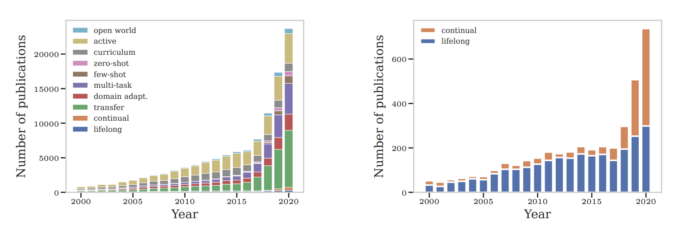

## 什么是持续学习？一言以蔽之！

简单来说，持续学习（也叫增量学习）就是一个不断增量新的数据，并且不断更新模型，使之能够逐步掌握越来越多的任务、能力、知识的过程。其更加长期的学习模式，也可以被称为终身学习。持续学习非常关注训练有效性和训练的泛化能力，总的来说，持续学习在追求一个稳定的学习过程。可以说这种思维方式是面向通才模型的一种可能的路径。

很多情况下使用持续学习的原因是，不同组数据之间所包含的内容并不相通，或者说分布上会存在明显的差异，所以需要分批次地进行学习，其实现在的一些多模态大语言模型的训练也有这样的影子，训练者会选择先训练一部分模态数据，然后再增量地训练别的数据。比如π0时期，VLA训练会出现被过分拟合到V-A映射的问题，在后续的KI中，通过一些方式让language也产生了作用。

在一些情况，我们面临的问题可能是数据量过大，那么就很难把之前的数据retrain了，所以我们需要一种能够留存之前的数据中学习的内容，并且可以快速的适应新的数据的算法，这也让持续学习在robotic里面有了非常重要的应用。在早先Boston Dynamic的Spot就有做这样的尝试，当时他们在采集Agile Mobile Robot的时候就会获得每周近乎三万TB的数据，那就很需要使用持续学习来一次成型并且尽可能保留记忆了。

## 正式的定义与训练的方式

对于持续学习，本质上是学习了一系列的”经验“，对于一个监督学习的例子来说，一段“经验”可以被表达为一批元素标签对。可以用形式化的表达来表示：

$$\mathcal{A}^{CL} : (f_{i-1}^{CL}, \mathcal{D}_{train}^{i}, \mathcal{M}_{i-1}, t_i) \rightarrow (f_i^{CL}, \mathcal{M}_i)$$

对于输入部分包含了当前的训练集和之前的knowledge buffer和模型以及任务标签，训练的结果就是一个新的模型和新的knowledge buffer，对于任务标签来说，往往可以用来进行数据的分布的标识。

在训练的过程当中，最基本的损失函数就是对于逐任务的加权损失：

$$\mathcal{L}_S(f_n^{CL}, n) = \frac{1}{\sum_{i=1}^{n} \vert \mathcal{D}_{test}^i \vert} \sum_{i=1}^{n} \mathcal{L}_{exp}(f_n^{CL}, \mathcal{D}_{test}^i)$$

对于每一个数据流的训练损失可能是不同的，这也充分体现了不同数据之间的特性，但是也是因此，随着任务的增加，让这个损失的可控性很糟糕。

对于持续学习，它和多任务学习、元学习以及迁移学习等训练范式是息息相关的，从本质上看，一个长期的、大量任务介入的持续学习，是有可能通过一些方法涌现出强有力的能力教会模型如何去学习（Learning to Learn），并且产生对于新数据域的zero/few-shot迁移。

## 简单的历史

- 在上世纪70-80年代就已经在一些rule-based系统当中产生了增量学习的概念
- 在1989年有作者提出了在神经网络中学习的遗忘问题，因此之后在90年代提出了使用Kernel Machine的方法来进行对神经网络的增量学习的方法
- 在1998年，Ring提出了持续学习的概念，同年Thrun提出了终身学习的概念。
- 在2009年，Mitchell提到了Never-ending Learning的概念
- 在2016年，深度持续学习框架被推出
- 在2020年，产生了一个相关领域的paper数量的激增，一直到现在在一些语言学习、具身智能的任务学习中，也使用了相关的技巧和框架。

## 面临的问题，灾难性遗忘。

灾难性遗忘（Catastrophic Forgetting），在随着新任务的加入后，模型会一定程度上遗忘或者把过去学到的知识和现在的知识进行混叠造成不稳定的问题。而且这个过程可能是突然的、骤降的，研究者们认为这可能是源于Gradient Descend这种方法带来的局限。我们可以从下图中看到，当一个模型能够学习到TaskA的能力，但是面对TaskB的学习的时候，会出现两条优化的方向，一个方向面向了TaskA和B的重叠，另一个方向就导致了仅仅偏向于B而离开了A的能力空间当中。

这也就导向了传统机器学习和持续学习的差异，相比于传统机器学习这种一股脑全部训练的方式，持续学习更加关注如何权衡之前的知识和新的知识的融合。从数据集的角度出发，传统的机器学习可能是在一个固定的set上进行训练，而持续学习则是unbounded的。

那我们该如何解决这个问题，其实非常直观的能想到一些方法，比如通过模型集成的方法、或者用部分之前的数据进行稳定、对模型网络中的一部分进行冻结、或者不同程度上给出训练的权重等等。在后续的章节中我们会聊到一些在近阶段使用的持续学习方法来高效进行robotic manipulation policy learning。

## Toolkit

Avalanche，提供了一个端到端的持续学习平台，

## 参考文献

[1] [CLEVA-COMPASS: A CONTINUAL LEARNING EVALUATION ASSESSMENT COMPASS TO PROMOTE RESEARCH TRANSPARENCY AND COMPARABILITY](https://arxiv.org/pdf/2110.03331)

[2] [Continual Learning for Robotics: Definition, Framework, Learning Strategies, Opportunities and Challenges](https://arxiv.org/pdf/1907.00182)

[3] [CORe50 Dataset](https://vlomonaco.github.io/core50/)

[4] [Overcoming catastrophic forgetting in neural networks](https://arxiv.org/pdf/1612.00796)

[5] [Avalanche](https://avalanche.continualai.org/)
