import { Card } from 'astro-pure/user'
import { Timeline } from 'astro-pure/user'
import { Aside } from 'astro-pure/user'

<Aside type="tip">
点击card可以导航到对应的paper页面。
</Aside>

## OpenVLA系列工作

<Card
  as='a'
  href='https://arxiv.org/pdf/2406.09246'
  heading='OpenVLA: An Open-Source Vision-Language-Action Model'
  subheading='具身操作VLA foundation model'
  date='2024-06'
>
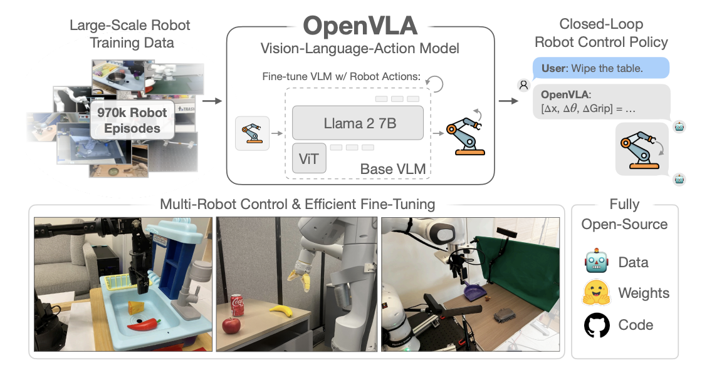
</Card>
 
<Card
  as='a'
  href='https://arxiv.org/pdf/2502.19645'
  heading='Fine-Tuning Vision-Language-Action Models: Optimizing Speed and Success'
  subheading='具身操作VLA foundation model'
  date='2025-02-01'
>
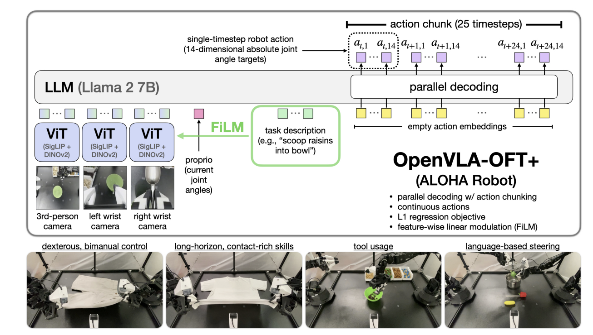
</Card>
 

## RDT系列工作
<Card
  as='a'
  href='https://arxiv.org/pdf/2410.07864'
  heading='RDT-1B: a Diffusion Foundation Model for Bimanual Manipulation'
  subheading='双臂协同操作foundation model'
  date='2024-10'
>
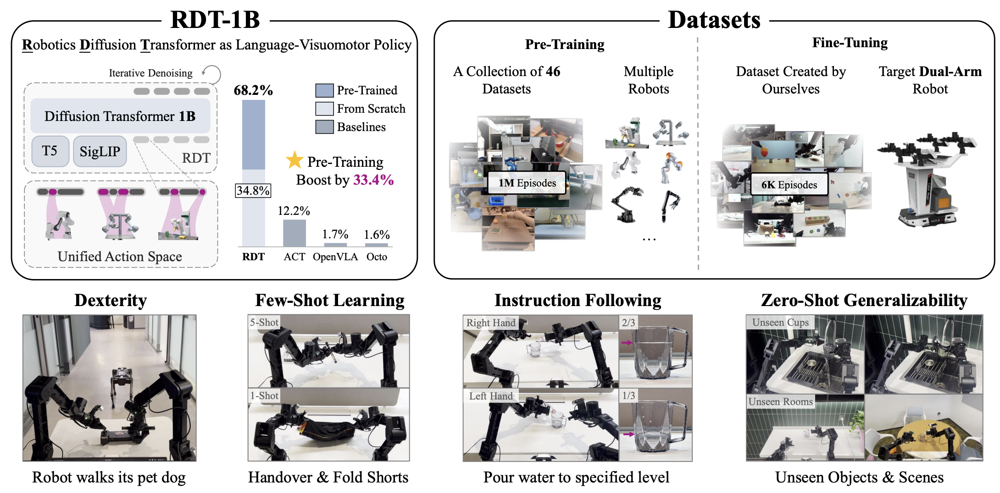
</Card>
 
<Card
  as='a'
  href='https://www.arxiv.org/pdf/2507.23523'
  heading='H-RDT: Human Manipulation Enhanced Bimanual Robotic Manipulation'
  subheading='面向更加数据高效的双臂协同操作foundation model'
  date='2024-10'
>
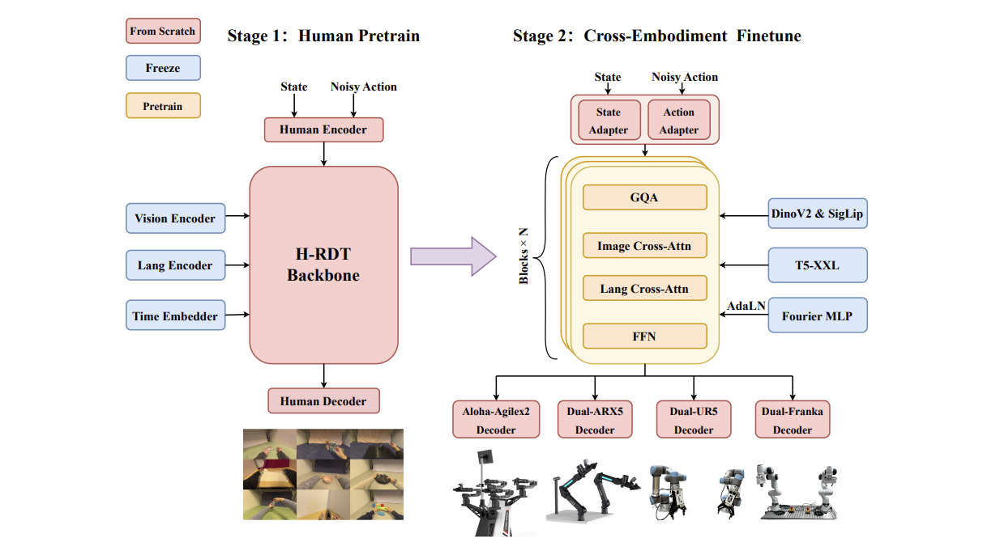
</Card>
## TikTok GR系列工作

<Card
  as='a'
  href='https://arxiv.org/pdf/2312.13139'
  heading='UNLEASHING LARGE-SCALE VIDEO GENERATIVE PRE-TRAINING FOR VISUAL ROBOT MANIPULATION'
  subheading='字节跳动提出的基于大规模视频预训练模型'
  date='2023-12'
>
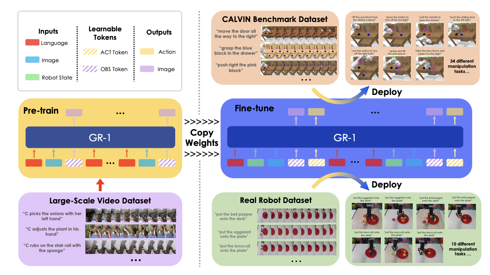
</Card>
 
<Card
  as='a'
  href='https://arxiv.org/pdf/2410.06158'
  heading='GR-2: A Generative Video-Language-Action Model with Web-Scale Knowledge for Robot Manipulation'
  subheading='字节跳动提出的基于大规模视频预训练模型'
  date='2024-10'
>
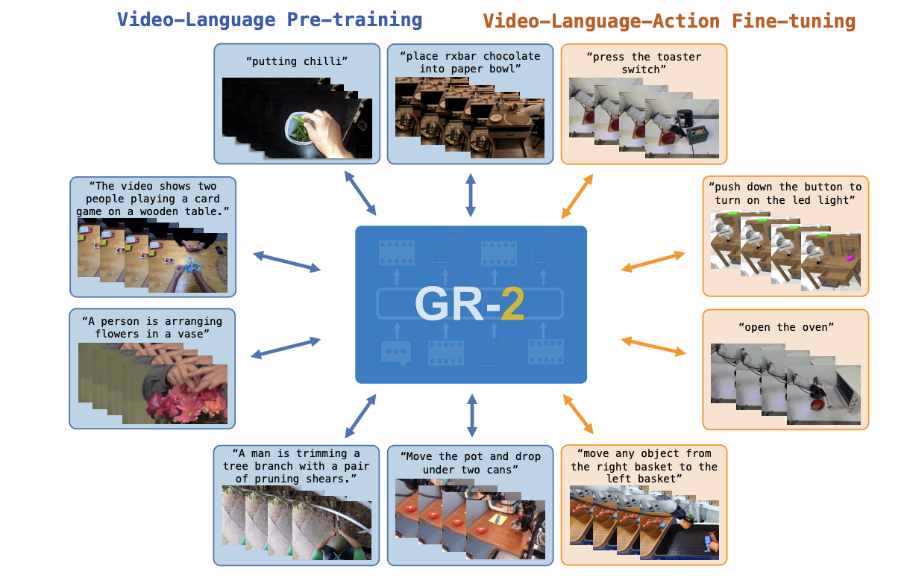
</Card>
 
<Card
  as='a'
  href='https://arxiv.org/html/2507.15493v1'
  heading='GR-3 Technical Report'
  subheading='字节跳动提出的基于大规模视频预训练模型'
  date='2025-07-01'
>
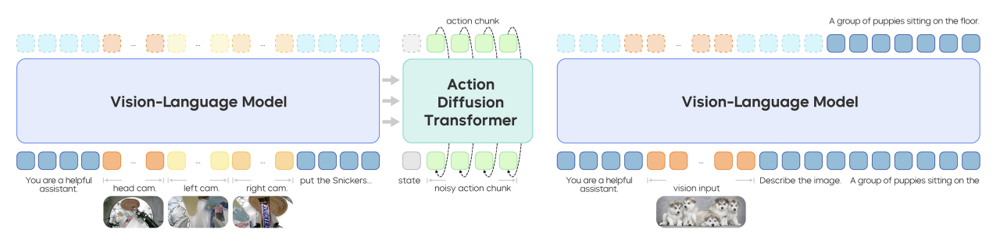
</Card>
 

## Google-Research RT系列工作

<Card
  as='a'
  href='https://arxiv.org/pdf/2212.06817'
  heading='RT-1: Robotics Transformer for Real-World Control at Scale'
  subheading='RT系列VLA关键工作'
  date='2022-12'
>
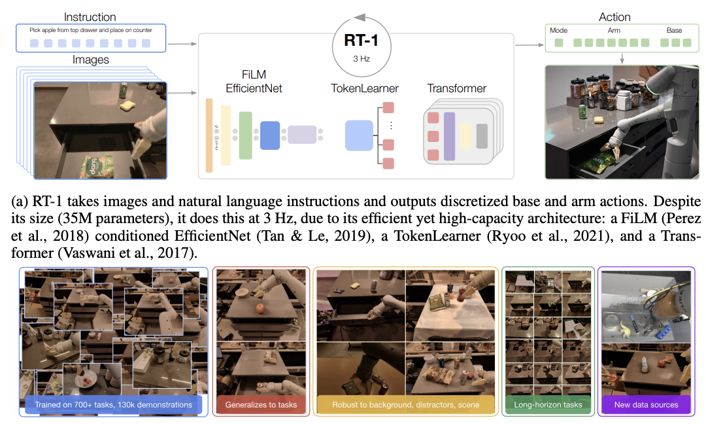
</Card>
 
<Card
  as='a'
  href='https://arxiv.org/pdf/2307.15818'
  heading='RT-2: Vision-Language-Action Models Transfer Web Knowledge to Robotic Control'
  subheading='RT系列VLA关键工作'
  date='2023-07'
>
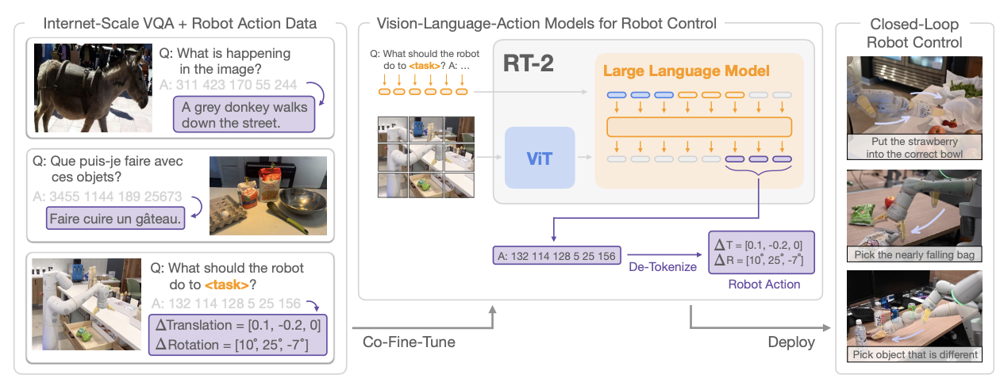
</Card>
 

## PaLM-E系列工作

<Card
  as='a'
  href='https://arxiv.org/pdf/2303.03378'
  heading='PaLM-E: An Embodied Multimodal Language Model'
  subheading='PaLM-E系列关键工作'
  date='2023-03'  
>
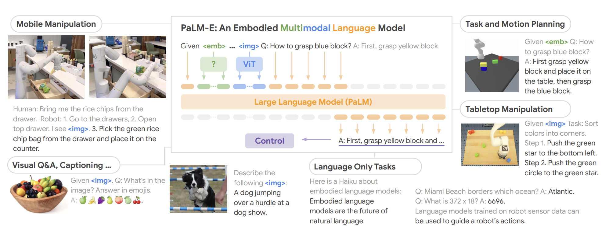
</Card>
 

## Meta-AI系列工作

<Card
  as='a'
  href='https://arxiv.org/pdf/2203.12601'
  heading='R3M: A Universal Visual Representation for Robot Manipulation'
  subheading='Meta-AI系列关键工作'
  date='2022-03'  
>
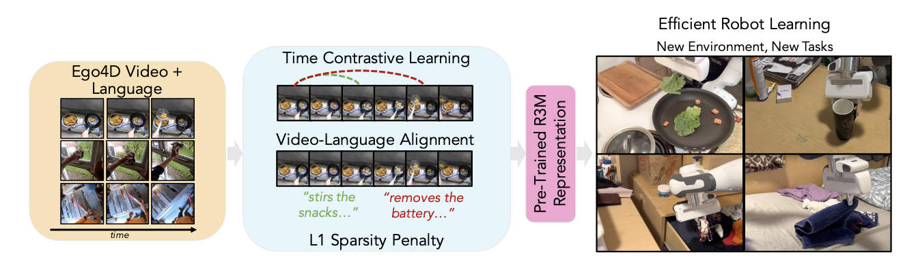
</Card>

## π系列工作

<Card
  as='a'
  href='https://arxiv.org/pdf/2410.24164v1'
  heading='π0: A Vision-Language-Action Flow Model for General Robot Control'
  subheading='PI系列VLA关键工作'
  date='2024-10'
>
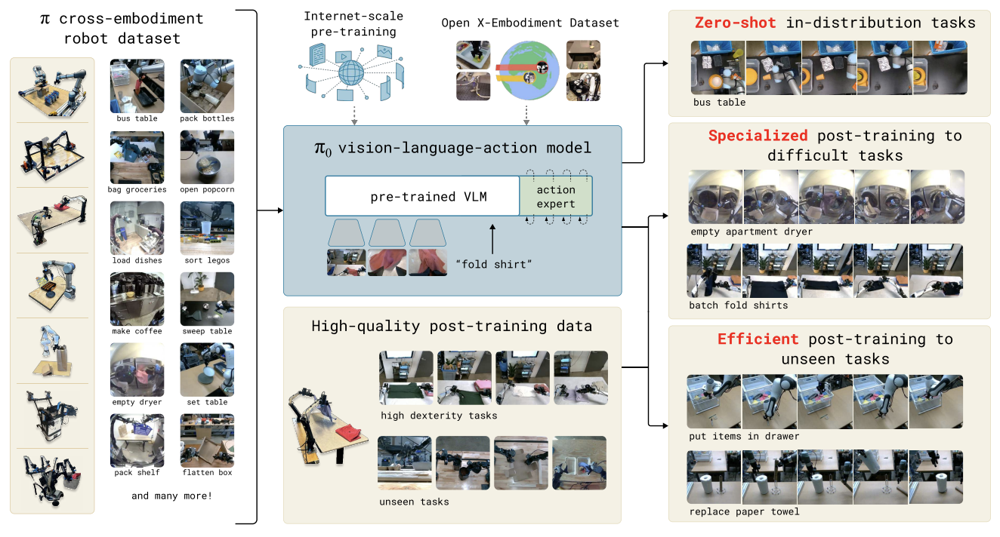
</Card>
 
<Card
  as='a'
  href='https://arxiv.org/pdf/2410.24164v1'
  heading='π0.5: a Vision-Language-Action Model with Open-World Generalization'
  subheading='PI系列VLA关键工作'
  date='2024-10'
>
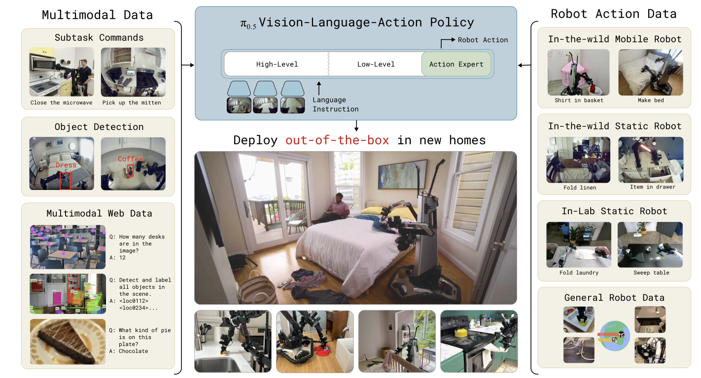
</Card>
 

## Being-Beyond系列工作

<Card
  as='a'
  href='https://arxiv.org/pdf/2507.15597'
  heading='Being-H0: Vision-Language-Action Pretraining from Large-Scale Human Videos'
  subheading='通过现有的大规模数据，构建具身操作的foundation model'
  date='2025-07'
>
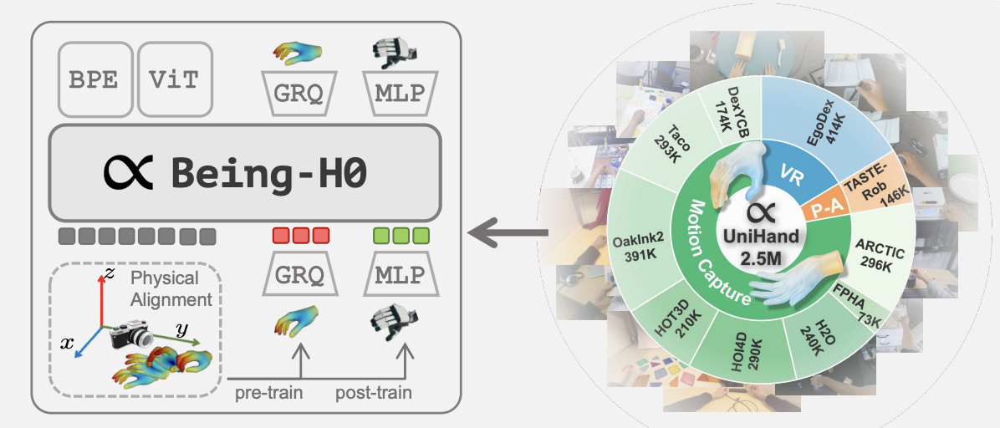
</Card>
 

<Card
  as='a'
  href='https://arxiv.org/pdf/2503.12533?'
  heading='Being-0: A Humanoid Robotic Agent with Vision-Language Models and Modular Skills'
  subheading='通过现有的大规模数据，构建具身操作的foundation model'
  date='2025-03'
>
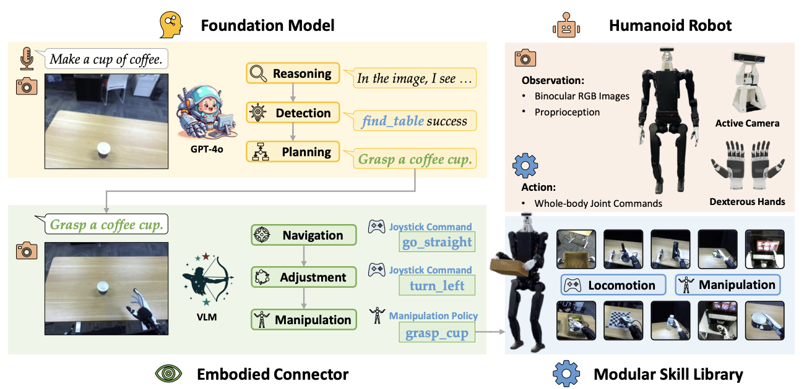
</Card>

## Agibot系列工作

<Card
  as='a'
  href='https://arxiv.org/pdf/2503.06669'
  heading='AgiBot World Colosseo: A Large-scale Manipulation Platform for Scalable and Intelligent Embodied Systems'
  subheading='Agibot系列关键工作'
  date='2025-03'
>
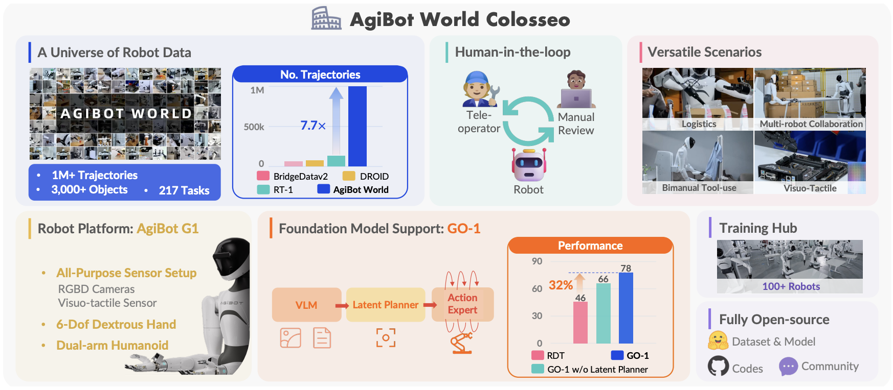
</Card>
 

<Card
  as='a'
  href='https://arxiv.org/pdf/2508.05635v1'
  heading='Genie Envisioner: A Unified World Foundation Platform for Robotic Manipulation'
  subheading='Agibot系列关键工作'
  date='2025-08'
>
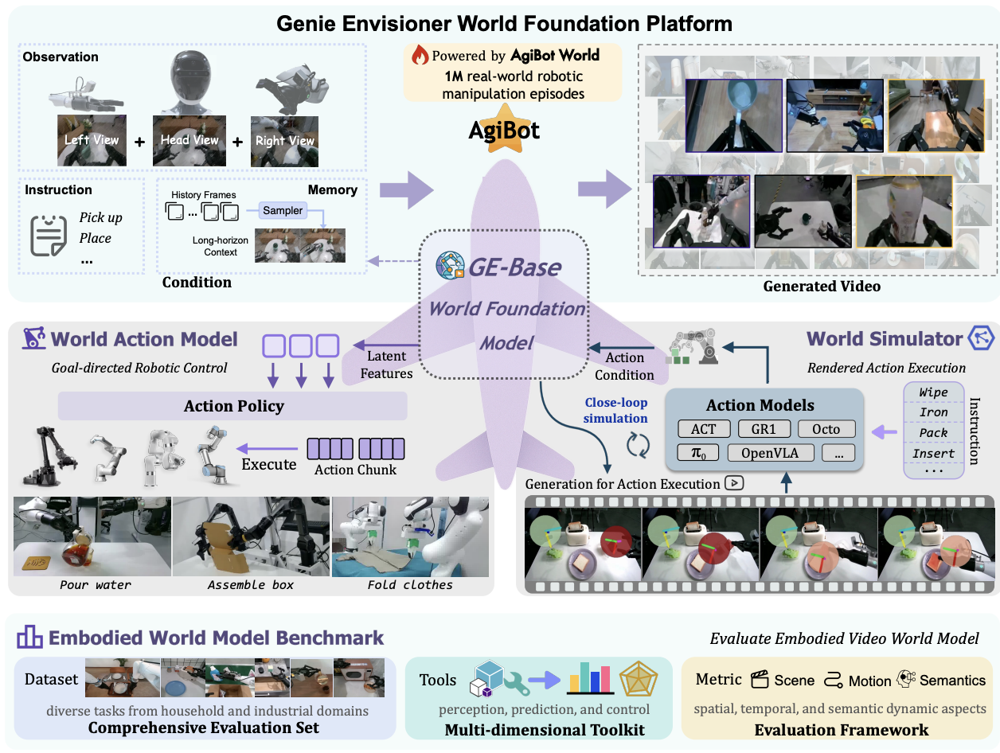
</Card>
 

## Octo系列工作
<Card
  as='a'
  href='https://arxiv.org/pdf/2405.12213'
  heading='Octo: An Open-Source Generalist Robot Policy'
  subheading='Octo系列关键工作'
  date='2024-05'
>
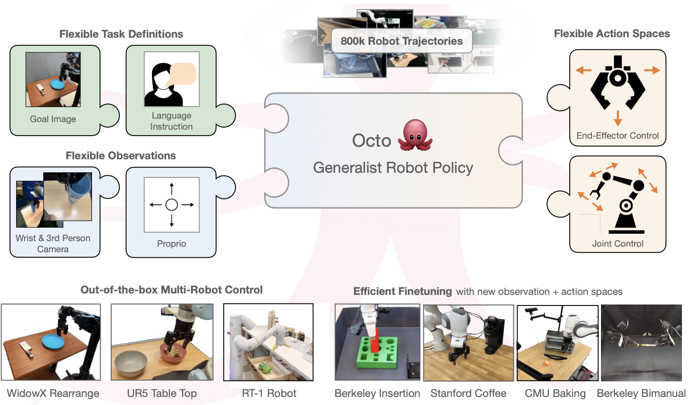
</Card>
 

## Embodied-R1 Series
<Card
  as='a'
  href='https://arxiv.org/pdf/2508.13998'
  heading='Embodied-R1: Reinforced Embodied Reasoning for General Robotic Manipulation'
  subheading='参照R1的训练方法，进行Embodied Reasoning'
  date='2025-08'
>
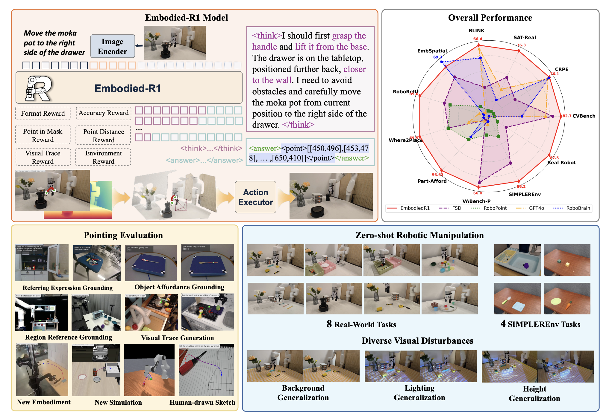
</Card>

## 星海图系列工作

<Card
  as='a'
  href='https://github.com/OpenGalaxea/G0/blob/main/Galaxea_G0_report.pdf'
  heading='Galaxea Open-World Dataset & G0 Dual-System VLA Model'
  subheading='星海图首个双系统VLA模型和开源数据集'
  date='2025-08'
>
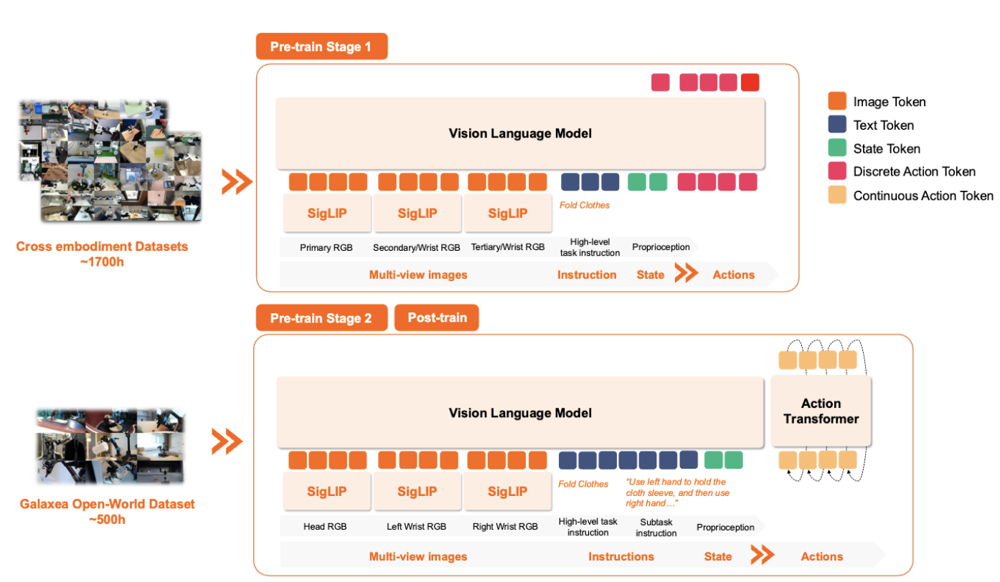
</Card>

## 1X系列工作

<Card
  as='a'
  href='https://www.1x.tech/1x-world-model.pdf'
  heading='1X World Model: Evaluating Bits, not Atoms'
  subheading='1X系列世界模型'
  date='2025-08'
>
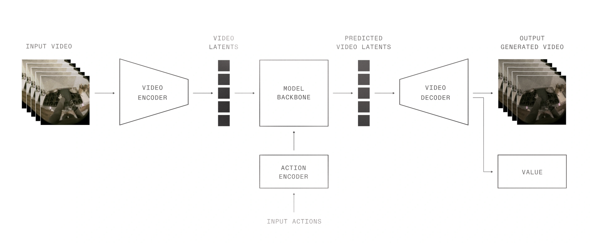
</Card>

## NVIDIA GR00T系列工作

<Card
  as='a'
  href='https://arxiv.org/pdf/2503.14734'
  heading='GR00T N1: An Open Foundation Model for Generalist Humanoid Robots'
  subheading='NVIDIA GR00T系列首个工作，实现了大小脑模型架构'
  date='2025-03'
>
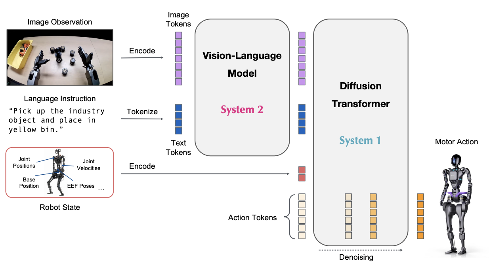
</Card>
 

<Card
  as='a'
  href='https://research.nvidia.com/labs/gear/gr00t-n1_5/'
  heading='GR00T N1.5: An Improved Open Foundation Model for Generalist Humanoid Robots'
  subheading='NVIDIA GR00T系列关键工作'
  date='2025-06'
>
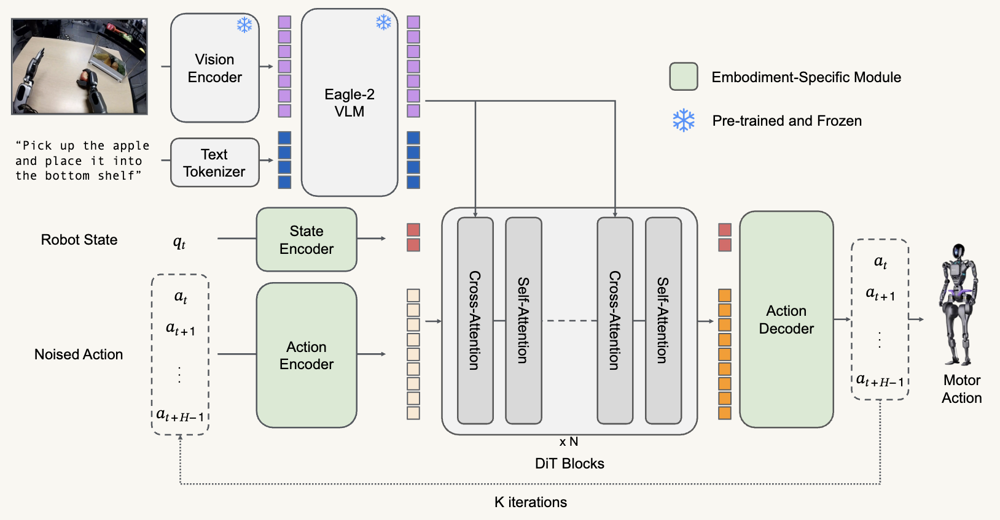
</Card>
*Last updated: Aug.21 2025*