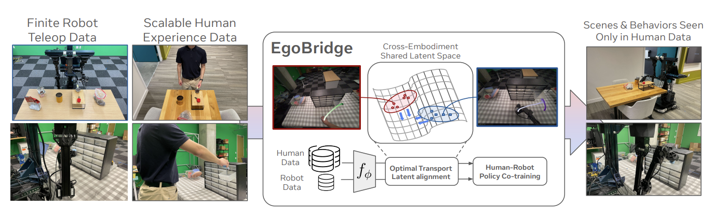

import { Card } from 'astro-pure/user'
import { Timeline } from 'astro-pure/user'
import { Aside } from 'astro-pure/user'

<Aside type="tip">
点击card可以导航到对应的paper页面。
</Aside>

## 主要工作

<Card
  as='a'
  href='https://www.arxiv.org/pdf/2509.19626'
  heading='EgoBridge: Domain Adaptation for Generalizable Imitation from Egocentric Human Data'
  subheading='使用最优化传输的方法进行人类数据和具身数据的迁移'
  date='2025-09'
>

</Card>
 

---

*Last updated: Jan.01 2025*
