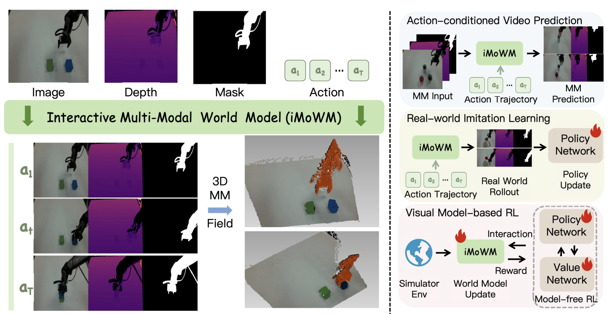

import { Card } from 'astro-pure/user'
import { Timeline } from 'astro-pure/user'
import { Aside } from 'astro-pure/user'

<Aside type="tip">
点击card可以导航到对应的paper页面。
</Aside>

## 主要工作

### Video Generation Model as World Model

<Card
  as='a'
  href='https://arxiv.org/pdf/2510.09036'
  heading='iMoWM: Taming Interactive Multi-Modal World Model for Robotic Manipulation'
  subheading='使用多模态信息来产生3D未来帧辅助具身操作'
  date='2025-10'
>

</Card>
 

### 相关工作

---

*Last updated: Jan.01 2025*
